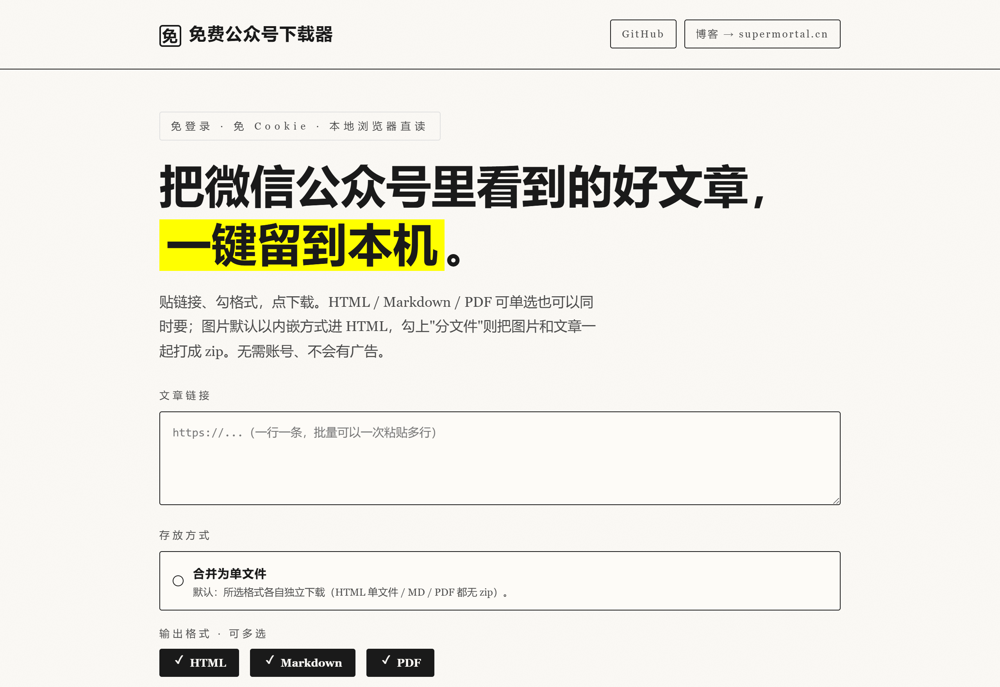

# 微信公众号在线下载器

> 在本机浏览器里把公众号文章存成可移植的本地文件。

粘贴一条或一批 `mp.weixin.qq.com` 链接，选 HTML / Markdown / PDF，浏览器自动下载。支持"合并为单文件"和"分文件 + 打 zip"两种模式。

GitHub: [super-mortal/wechat_downloads](https://github.com/super-mortal/wechat_downloads)



## 特性

- 零账号、零代理：起一个本地 HTTP 服务，用本机 Chromium 打开公众号页面再渲染
- 三种格式可选：`html` / `md` / `pdf`，可单选可多选
- 两种产物模式：
  - **合并为单文件（默认）**：HTML 把图片 base64 内嵌、Markdown 保留远程图片、PDF 自包含；所选格式各自独立下载
  - **分文件 + 打 zip**：HTML 与 Markdown 用 `imgs/` 相对路径引图；整批产物 + `imgs/` 打包成单个 `.zip`，批量时每篇一个子目录
- **零落盘**：所有产物（HTML / Markdown / PDF / 图片）全部在内存里组装，直接由浏览器下载，服务器不在磁盘上留任何文件
- 零三方 zip 依赖：自带一个 store-only 的 ZIP 拼装器

## 安装

需要 Node.js 18+。`npm install` 会自动拉一份本地 headless Chromium 到 `node_modules/`。

```bash
cd wechat_downloads
npm install
```

## 启动本地服务

```bash
npm start
# ready · http://127.0.0.1:3915
```

浏览器打开 `http://127.0.0.1:3915`，把链接粘贴进文本框（一条一行），勾选要导出的格式，再点"下载"。页面上有一个"合并为单文件 / 分文件 + 打 zip"开关。

| 开关状态 | 行为 | 批量限制 |
|---|---|---|
| 关（默认） | HTML / MD / PDF 各产一份独立下载 | 单次最多 5 条 |
| 开 | 所有产物 + `imgs/` 打包成单个 zip | 无条数限制 |

> 产物**全部在内存里组装**，由浏览器直接接收，不会在项目目录留任何中间文件。临时文件池在 5 分钟无访问后自动回收，最多同时保留 200 条。

## 命令行

```bash
node cli.mjs <url> [out-prefix] [formats] [split]
# formats 逗号分隔，可选：html,md,pdf（默认 html,md,pdf）
# split   on/off（默认 off）
# 例：node cli.mjs https://mp.weixin.qq.com/s/xxx my-article md,pdf on
```

CLI 把产物写到 `./out/` 下，便于脚本接入。

## HTTP 接口

`POST /download`

```json
{
  "urls":    ["https://mp.weixin.qq.com/s/xxx"],
  "formats": ["html", "md", "pdf"],
  "split":   false
}
```

- `split=false` → 返回 JSON 清单，每条带 `url`（形如 `/dl/<id>`），前端逐个 `fetch().blob()` 触发下载；下载完服务端立即从内存池里清掉
- `split=true`  → 直接返回 `application/zip`
- `split=false` 且 `urls.length > 5` → `400`：要批量请开 split

## 项目结构

| 文件 | 作用 |
|---|---|
| `engine.mjs`  | 浏览器引擎的本地适配层；只有这个文件 import `playwright` |
| `article.mjs` | 主逻辑：拿 DOM、下载图片、组装三种格式，**全程纯内存** |
| `zip.mjs`     | 零依赖的 ZIP（store-only）拼装器 |
| `server.mjs`  | 本地 HTTP 服务 + 内嵌 UI；产物在内存池里短暂驻留 |
| `cli.mjs`     | 命令行入口；把内存里的产物写到 `./out/` |
| `out/`        | 仅 CLI 使用；服务端不会创建（已被 `.gitignore` 排除） |
| `assets/`     | README 截图 |

## 性能

- 启动 flags 调优：`--disable-gpu --disable-dev-shm-usage --disable-features=IsolateOrigins,site-per-process,Translate,BackForwardCache`
- 渲染完成后 `domcontentloaded` + 关键 selector + `1.5s` 收尾，避免抖动
- 图片并发下载，`15s` 超时；按内容 hash 命名缓存去重
- PDF 直接对自己拼出来的 HTML 做 `page.pdf()`（跳过广告 / 视频 / 外链 JS）

实测单条 URL 端到端约 `8–12s`。

## 限制

- 不下载视频源文件本身（公众号视频 / 腾讯视频链接都不会被拉）
- 极少数文章服务端会触发"环境异常"风控（与本工具无关）
- Markdown 的表格 / 代码块做了简化处理

## 许可证

MIT — Copyright © 2026 super-mortal

## 清理

项目自包含：删掉 `wechat_downloads/` 等于彻底卸载。`node_modules/` 是最大的一块，删之前可先 `npm install --prefix .` 之外的位置复用。

## 数据持久化

`微信公众号在线下载器` 在 `data/` 目录保存所有管理员态与归档数据。**pm2 重启 / 服务器重启 / 磁盘未损坏场景下不丢失**。

### 持久化文件清单

| 文件 | 内容 | 权限（Unix） |
|---|---|---|
| `data/auth.json` | 管理员密码 scrypt 哈希 + salt | `0600` |
| `data/sessions.json` | 活跃 session（默认 7 天滑动续期） | `0600` |
| `data/admin.log` | 审计日志（登录、改密、退出） | `0600` |
| `data/auth-failures.json` | 登录失败记录 | `0600` |
| `data/md/<pub-id>.md` | 抓取的 Markdown 原文 | 系统默认 |
| `data/storage_mdc.json` | 归档索引 | 系统默认 |
| `public/wechat/download/<slug>.html` + `<slug>.json` | 归档 HTML + 元数据 | 系统默认 |

### 持久化保证

- 写盘均使用 atomic rename（先写 `.tmp` 再 `fs.renameSync`），断电 / kill -9 不会写一半
- 启动时从 `data/auth.json` + `data/sessions.json` 重读到内存（§六 §六.A）
- `storage.mjs#init()` 启动加载归档索引（§六 §六.B）
- 服务器优雅关闭：`SIGTERM` / `SIGINT` → 排空 sessions + flush admin.log → `server.close`

### 备份与恢复

```bash
# 备份（§六.D）
node -e "import('./storage.mjs').then(m => m.backupDataDir('./backups/$(date +%Y%m%d)'))"

# 恢复（§六.E）
node -e "import('./storage.mjs').then(m => m.restoreDataDir('./backups/20260101/wxd-backup.zip'))"
```

### 迁移指南

从无鉴权版本（v2）升级到带鉴权版本（v4）：见 [MIGRATION.md](./MIGRATION.md)。

## 安全说明

- 默认无管理员账号时访问 `/admin` → 跳转 `/admin/setup`，**强制首次设置密码**（≥ 8 位）
- 改密会自动销毁其他设备的 session
- 紧急逃生口：`ADMIN_PASSWORD=新密码 pm2 restart ... --update-env`
